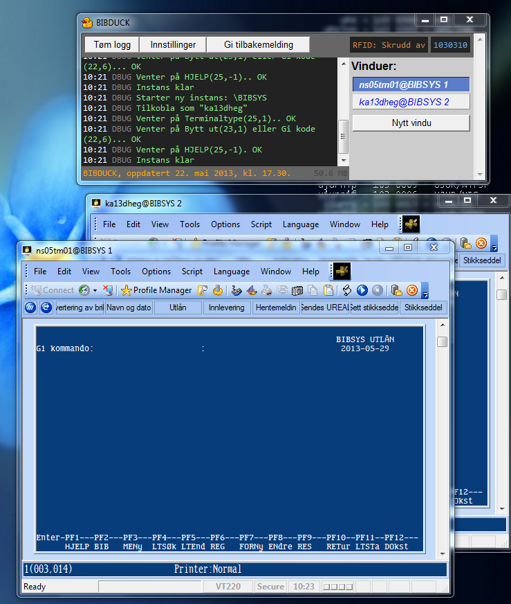

BIBDUCK
=============

BIBDUCK er et generelt JavaScript-bibliotek for automatisert kommunikasjon med BIBSYS ved hjelp av SecureNetTerms 
ActiveX-motorer, samt et HTA-basert brukergrensesnitt.

BIBDUCK-grensesnittet har en modulbasert tilnærming, og laster automatisk inn moduler fra mappen `plugins`.

- [Standardmoduler](#standardmoduler)
- [Hvordan bruke BIBDUCK-grensesnittet?](#hvordan-bruke-bibduck-grensesnittet)
- [Merknader](#merknader-og-tips)

Standardmoduler
------------

* [rfid.js](plugins/rfid.js) kaller et eksternt RFID-kontrollprogram basert på hvilken BIBSYS-skjerm som vises i 
  SecureNetTerm-vinduet som til enhver tid har fokus, slik at RFID-platen deaktiverer alarmen ved utlån
  (REG-skjerm), aktiverer den ved retur (RET-skjerm), og leser brikker ved behov  (f.eks. DOKST-skjerm). 
  Lesing skrus av når det ikke er nødvendig for å unngå at man kommer borti med en bok. For en oversikt
  over hvilke skjermer som er støttet, se [rfid.js](/scriptotek/bibduck/blob/master/plugins/rfid.js#L133).
  Vi har bare testet dette med RFID-platene fra Bibliotheca.

* [general.js](plugins/general.js) aksepterer dokid i forfatter-feltet (det øverste) på DOKST-skjermen, slik at man 
  slipper å tabbe ned til dokid-feltet. Modulen definerer også kommandoen `!!` for å tømme et felt
  man holder på å skrive i.

* [stikksedler.js](plugins/stikksedler.js) definerer kommandoen `stikkseddel!` for å skrive ut stikkseddel. Scriptet benytter seg 
  av den generelle konfigurasjonsfilen `stikksedler/config.json` og bibliotekspesifikk konfigurasjonsfil
  og maler (f.eks. `stikksedler/ureal.js` og `stikksedler/ureal/`) basert på bibliotekskoden man 
  angir i BIBDUCK-innstillingene.

* [imott-iret-auto.js](plugins/imott-iret-auto.js) er en automatiseringsprosedyre for å registrere utlån, skrive ut stikkseddel 
  og sende hentebeskjed for mottatte *lån*. Den gjør ikke noe med mottatte *kopier*.
  Modulen er under uttesting.

* [loggers.js](plugins/loggers.js) logger utlån, retur og dokst-besøk i loggvinduet, slik at man kan finne tilbake til 
  informasjon man "mister" fra BIBSYS-vinduet etter at en bruker har forlatt skranken. 
  Informasjonen lagres ikke til disk, og forsvinner når man logger BIBDUCK eller trykker på knappen "Tøm logg".
  Modulen definerer kommandoene `dokid!` og `ltid!` for å skrive ut hhv. siste dokid og ltid.

* [lstatus.js](plugins/lstatus.js) er en eksperimentell modul for å skrive ut en liste over alle brukerens lån. Dette gjøres med
  kommandoen `print!` på LTSTatus-skjermen. Modulen benytter Excel-arket `ltstatus.xls`.

* [dualbib.js](plugins/dualbib.js) er en svært eksperimentell modul for å arbeide med to vinduer samtidig. Modulen definerer
  kommandoen `n!` for å hoppe mellom vinduer og `skr,*x*!` for å vise resultat *x* fra et BIB-søk i 
  et annet vindu.

* [roald.js](plugins/roald.js) definerer kommandoen `roald!` for å åpne emneordsprogrammet [Roald](http://folk.uio.no/knuthe/progdist/). 
  Modulen er et godt utgangspunkt for å lage egne moduler for å kalle eksterne kommandoer.

* [efo.js](plugins/efo.js) definerer kommandoen `efo!` for å fornye lån med purrestatus E i én operasjon.

Hvordan bruke BIBDUCK-grensesnittet?
-------------

Lukk eventuelle åpne BIBSYS-vinduer før du starter. BIBDUCK kan kun kommunisere med BIBSYS-instanser startet fra BIBDUCK.
Start deretter BIBDUCK fra ikonet på skrivebordet:

Man får da opp BIBDUCK-grensesnittet:

Trykk på knappen **Nytt vindu** for å starte en ny BIBSYS-instans, der du logger inn som vanlig.
Som et eksempel på makrofunksjonalitet, leder BIBDUCK deg imidlertid automatisk gjennom 
innledningsskjermene frem til skjermen BIBSYS Søking. BIBDUCK sørger dessuten for at NumLock-tilstanden bevares 
gjennom innloggingsprosessen (SNetTerm skrur vanligvis av NumLock).

Trykker du på **Nytt vindu** igjen, startes en ny instans "BIBSYS 2", osv... 
Vinduet som har fokus indikeres med blå bakgrunnsfarge i BIBDUCK. Et vindu får fokus når du skriver i det, eller
trykker i det blå området. Normalt trenger man ikke å tenke på fokus.

Prøv å gå til REG-skjermen, og legg merke til at RFID-kontrollerprogrammet endrer modus:

Legg merke til at brukernavn vises i vindustittelen. RFID-status vises også etter første modus-endring.
Man kan da sjekke RFID-status selv om RFID-kontrollerprogrammet er minimert. 
Så lenge man ikke er ekstremt presset på skjermplass anbefales det imidlertid å ha RFID-kontrollerprogrammet 
oppe, så man kan holde et lite øye med at modus endres som den skal.
En sjelden gang hender det f.eks. at RFID-kontrollerprogrammet mister kontakten med RFID-plata, 
og det vises da en feilmelding med hvit skrift på rød bakgrunn i vinduet. 
BIBDUCK klarer imidlertid *ikke* å fange opp denne informasjonen og vil derfor fortsette som om alt var normalt.

Merknader og tips
-------------
* RFID-kontrollerprogramvaren fra Bibliotheca håndterer ikke modus-endringer mens det 
ligger en (eller flere) bøker på platen. Det går derfor ikke an å f.eks. deaktivere og deretter aktivere
alarmen mens en bok ligger på platen. 
* Man kan laste inn tilleggsfunksjoner på nytt ved å trykke ctrl-r
* Man kan endre loggnivå med ctrl-0 (debug), ctrl-1 (info), ctrl-2 (warn) og ctrl-3 (error)
* Erfaringer og kjente feil: [For IT ansvarlige ved UBO og andre nysgjerrige](//github.com/scriptotek/bibduck/wiki/For-IT-ansvarlige-og-andre-nysgjerrige)
